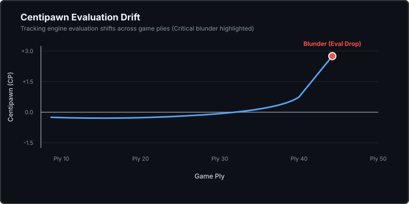
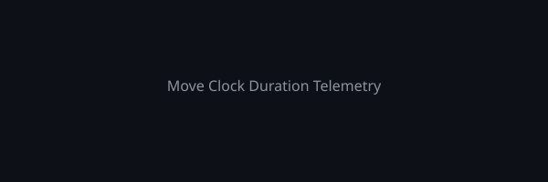

# GambitLens ♟️🔍

An open-source MLOps engine that ingests raw move-level chess telemetry from Lichess, trains automated blunder classifiers, and generates natural-language tactical coaching with pure-SVG diagnostic charts.

---

## 📖 The Story Behind gambit-lens

In competitive chess, high-level engines like Stockfish output raw numeric evaluations (+1.4, -3.2) and deep principal variations that remain cryptic to intermediate players. Existing commercial tools lock actionable coaching behind heavy paywalls.

gambit-lens was engineered as an open, autonomous agentic engine that transforms raw move-level telemetry into natural-language tactical coaching. It ingests move times, centipawn losses, and positional board states from Lichess, runs classification models to pinpoint blunders, and leverages LLM agents to deliver natural language feedback at zero operational cost.

---

## 🏗️ Production System Architecture

---

## 💡 Sample Tactical Coaching Output

---

## 📊 Live System Telemetry & Diagnostics

Below are the automatically rendered SVG diagnostic charts presenting evaluation drift and clock duration correlation across analyzed game plies:

### Centipawn Evaluation Drift

### Move Clock Duration Telemetry

---

## 🧪 Comprehensive Testing Suite

All engine components are covered by unit tests verified across Python environments:

| Module | Purpose | Test Status |
| :--- | :--- | :--- |
|  | Lichess PGN stream parsing & eval regex extraction | ✅ Passed |
|  | Centipawn loss (CPL) & game phase tagging | ✅ Passed |
|  | Standalone blunder prediction model | ✅ Passed |
|  | Pure-Python SVG diagnostic chart generator | ✅ Passed |
|  | LLM tactical coaching explanation fallback loop | ✅ Passed |

Full test logs are archived in .

---

## ⚡ Quick Start

---

## 🤖 Continuous Integration & Automated Workflows

gambit-lens executes automatically on a daily schedule (). Every 24 hours, the runner ingests fresh game telemetry, validates model accuracy, updates diagnostic SVG assets, and synchronizes outputs back to the repository.
